# Guía de Integraciones - Ecosistema de Emprendimiento

## 🎯 Visión General

Esta documentación detalla todas las integraciones externas implementadas en el ecosistema de emprendimiento, incluyendo configuración, implementación, manejo de errores y mejores prácticas para cada servicio.

## 🏗️ Arquitectura de Integraciones

```mermaid
graph TB
    subgraph "Core Application"
        APP[Flask Application]
        CELERY[Celery Workers]
        WEBHOOK[Webhook Handler]
    end
    
    subgraph "Authentication & Identity"
        GOOGLE_OAUTH[Google OAuth 2.0]
        LINKEDIN[LinkedIn OAuth]
        GITHUB[GitHub OAuth]
        MICROSOFT[Microsoft OAuth]
    end
    
    subgraph "Google Workspace"
        GCAL[Google Calendar API]
        GMEET[Google Meet API]
        GDRIVE[Google Drive API]
        GMAIL[Gmail API]
        GSHEETS[Google Sheets API]
    end
    
    subgraph "Communication Services"
        SENDGRID[SendGrid Email]
        TWILIO[Twilio SMS]
        SLACK[Slack Webhooks]
        TEAMS[MS Teams Webhooks]
    end
    
    subgraph "Storage & CDN"
        AWS_S3[AWS S3]
        CLOUDINARY[Cloudinary]
        GCS[Google Cloud Storage]
        CLOUDFLARE[CloudFlare CDN]
    end
    
    subgraph "Payment Processing"
        STRIPE[Stripe API]
        PAYPAL[PayPal API]
        MERCADOPAGO[MercadoPago API]
    end
    
    subgraph "Analytics & Monitoring"
        GOOGLE_ANALYTICS[Google Analytics]
        MIXPANEL[Mixpanel]
        SENTRY[Sentry Error Tracking]
        DATADOG[DataDog Monitoring]
    end
    
    subgraph "Business Intelligence"
        HUBSPOT[HubSpot CRM]
        SALESFORCE[Salesforce API]
        AIRTABLE[Airtable API]
        NOTION[Notion API]
    end
    
    APP --> GOOGLE_OAUTH
    APP --> LINKEDIN
    APP --> GITHUB
    APP --> MICROSOFT
    
    APP --> GCAL
    APP --> GMEET
    APP --> GDRIVE
    APP --> GMAIL
    APP --> GSHEETS
    
    CELERY --> SENDGRID
    CELERY --> TWILIO
    APP --> SLACK
    APP --> TEAMS
    
    APP --> AWS_S3
    APP --> CLOUDINARY
    APP --> GCS
    CLOUDFLARE --> APP
    
    APP --> STRIPE
    APP --> PAYPAL
    APP --> MERCADOPAGO
    
    APP --> GOOGLE_ANALYTICS
    APP --> MIXPANEL
    APP --> SENTRY
    APP --> DATADOG
    
    APP --> HUBSPOT
    APP --> SALESFORCE
    APP --> AIRTABLE
    APP --> NOTION
    
    WEBHOOK --> STRIPE
    WEBHOOK --> GOOGLE_OAUTH
    WEBHOOK --> SLACK
```



## 🔐 Configuración de Autenticación y OAuth

### Google OAuth 2.0

```python
# app/services/oauth/google_oauth.py
import google.auth.transport.requests
import google.oauth2.credentials
from google_auth_oauthlib.flow import Flow
from googleapiclient.discovery import build
import json

class GoogleOAuthService:
    def __init__(self):
        self.client_config = {
            "web": {
                "client_id": current_app.config['GOOGLE_OAUTH_CLIENT_ID'],
                "client_secret": current_app.config['GOOGLE_OAUTH_CLIENT_SECRET'],
                "auth_uri": "https://accounts.google.com/o/oauth2/auth",
                "token_uri": "https://oauth2.googleapis.com/token",
                "redirect_uris": [current_app.config['GOOGLE_OAUTH_REDIRECT_URI']]
            }
        }
        
        self.scopes = [
            'openid',
            'email',
            'profile',
            'https://www.googleapis.com/auth/calendar',
            'https://www.googleapis.com/auth/drive.file',
            'https://www.googleapis.com/auth/gmail.send'
        ]
    
    def get_authorization_url(self, state=None):
        """Genera URL de autorización para Google OAuth"""
        try:
            flow = Flow.from_client_config(
                self.client_config,
                scopes=self.scopes,
                state=state
            )
            flow.redirect_uri = self.client_config['web']['redirect_uris'][0]
            
            authorization_url, state = flow.authorization_url(
                access_type='offline',
                include_granted_scopes='true',
                prompt='consent'
            )
            
            return authorization_url, state
            
        except Exception as e:
            current_app.logger.error(f"Error generating Google OAuth URL: {str(e)}")
            raise
    
    def exchange_code_for_tokens(self, code, state):
        """Intercambia código de autorización por tokens"""
        try:
            flow = Flow.from_client_config(
                self.client_config,
                scopes=self.scopes,
                state=state
            )
            flow.redirect_uri = self.client_config['web']['redirect_uris'][0]
            
            # Obtener tokens
            flow.fetch_token(code=code)
            credentials = flow.credentials
            
            # Obtener información del usuario
            user_info_service = build('oauth2', 'v2', credentials=credentials)
            user_info = user_info_service.userinfo().get().execute()
            
            return {
                'access_token': credentials.token,
                'refresh_token': credentials.refresh_token,
                'expires_at': credentials.expiry.timestamp() if credentials.expiry else None,
                'user_info': user_info,
                'credentials_json': credentials.to_json()
            }
            
        except Exception as e:
            current_app.logger.error(f"Error exchanging Google OAuth code: {str(e)}")
            raise
    
    def refresh_access_token(self, refresh_token):
        """Refresca el token de acceso usando refresh token"""
        try:
            credentials = google.oauth2.credentials.Credentials(
                token=None,
                refresh_token=refresh_token,
                token_uri=self.client_config['web']['token_uri'],
                client_id=self.client_config['web']['client_id'],
                client_secret=self.client_config['web']['client_secret']
            )
            
            request = google.auth.transport.requests.Request()
            credentials.refresh(request)
            
            return {
                'access_token': credentials.token,
                'expires_at': credentials.expiry.timestamp() if credentials.expiry else None
            }
            
        except Exception as e:
            current_app.logger.error(f"Error refreshing Google token: {str(e)}")
            raise
```

### Configuración OAuth Multi-Provider

```python
# app/services/oauth/oauth_manager.py
from typing import Dict, Any
import requests
from .google_oauth import GoogleOAuthService
from .linkedin_oauth import LinkedInOAuthService
from .github_oauth import GitHubOAuthService

class OAuthManager:
    def __init__(self):
        self.providers = {
            'google': GoogleOAuthService(),
            'linkedin': LinkedInOAuthService(),
            'github': GitHubOAuthService()
        }
    
    def get_provider(self, provider_name: str):
        """Obtiene el proveedor OAuth específico"""
        if provider_name not in self.providers:
            raise ValueError(f"OAuth provider '{provider_name}' not supported")
        return self.providers[provider_name]
    
    def get_authorization_url(self, provider_name: str, state: str = None):
        """Genera URL de autorización para cualquier proveedor"""
        provider = self.get_provider(provider_name)
        return provider.get_authorization_url(state)
    
    def authenticate_user(self, provider_name: str, code: str, state: str = None):
        """Autentica usuario con cualquier proveedor OAuth"""
        provider = self.get_provider(provider_name)
        return provider.exchange_code_for_tokens(code, state)

# Uso en views
oauth_manager = OAuthManager()

@bp.route('/auth/<provider>/login')
def oauth_login(provider):
    state = generate_random_string(32)
    session['oauth_state'] = state
    
    auth_url, _ = oauth_manager.get_authorization_url(provider, state)
    return redirect(auth_url)

@bp.route('/auth/<provider>/callback')
def oauth_callback(provider):
    if request.args.get('state') != session.get('oauth_state'):
        abort(400)
    
    code = request.args.get('code')
    if not code:
        abort(400)
    
    try:
        user_data = oauth_manager.authenticate_user(provider, code, session['oauth_state'])
        # Crear o actualizar usuario en la base de datos
        user = create_or_update_oauth_user(provider, user_data)
        login_user(user)
        return redirect(url_for('main.dashboard'))
    except Exception as e:
        flash('Error en la autenticación. Intenta nuevamente.', 'error')
        return redirect(url_for('auth.login'))
```

## 📅 Integración Google Workspace

### Google Calendar Integration

```python
# app/services/google_calendar.py
from googleapiclient.discovery import build
from google.oauth2.credentials import Credentials
from datetime import datetime, timedelta
import pytz

class GoogleCalendarService:
    def __init__(self, user_credentials):
        self.credentials = Credentials.from_authorized_user_info(user_credentials)
        self.service = build('calendar', 'v3', credentials=self.credentials)
    
    def create_meeting(self, title, description, start_time, end_time, 
                      attendee_emails, location=None, meet_link=True):
        """Crea una reunión en Google Calendar con Google Meet"""
        try:
            # Configurar zona horaria
            timezone = pytz.timezone(current_app.config.get('TIMEZONE', 'UTC'))
            
            event = {
                'summary': title,
                'description': description,
                'start': {
                    'dateTime': start_time.isoformat(),
                    'timeZone': str(timezone),
                },
                'end': {
                    'dateTime': end_time.isoformat(),
                    'timeZone': str(timezone),
                },
                'attendees': [{'email': email} for email in attendee_emails],
                'reminders': {
                    'useDefault': False,
                    'overrides': [
                        {'method': 'email', 'minutes': 24 * 60},  # 1 día antes
                        {'method': 'popup', 'minutes': 30},       # 30 min antes
                    ],
                },
                'guestsCanInviteOthers': False,
                'guestsCanModify': False,
            }
            
            if location:
                event['location'] = location
            
            # Agregar Google Meet si se solicita
            if meet_link:
                event['conferenceData'] = {
                    'createRequest': {
                        'requestId': f"meet-{datetime.now().strftime('%Y%m%d%H%M%S')}",
                        'conferenceSolutionKey': {'type': 'hangoutsMeet'}
                    }
                }
            
            # Crear evento
            event = self.service.events().insert(
                calendarId='primary',
                body=event,
                conferenceDataVersion=1 if meet_link else 0,
                sendUpdates='all'
            ).execute()
            
            return {
                'event_id': event['id'],
                'html_link': event['htmlLink'],
                'meet_link': event.get('conferenceData', {}).get('entryPoints', [{}])[0].get('uri'),
                'created': event['created'],
                'updated': event['updated']
            }
            
        except Exception as e:
            current_app.logger.error(f"Error creating Google Calendar event: {str(e)}")
            raise
    
    def update_meeting(self, event_id, **updates):
        """Actualiza una reunión existente"""
        try:
            # Obtener evento actual
            event = self.service.events().get(
                calendarId='primary',
                eventId=event_id
            ).execute()
            
            # Aplicar actualizaciones
            for key, value in updates.items():
                if key in ['title', 'summary']:
                    event['summary'] = value
                elif key == 'description':
                    event['description'] = value
                elif key == 'start_time':
                    event['start']['dateTime'] = value.isoformat()
                elif key == 'end_time':
                    event['end']['dateTime'] = value.isoformat()
                elif key == 'attendees':
                    event['attendees'] = [{'email': email} for email in value]
            
            # Actualizar evento
            updated_event = self.service.events().update(
                calendarId='primary',
                eventId=event_id,
                body=event,
                sendUpdates='all'
            ).execute()
            
            return updated_event
            
        except Exception as e:
            current_app.logger.error(f"Error updating Google Calendar event: {str(e)}")
            raise
    
    def cancel_meeting(self, event_id):
        """Cancela una reunión"""
        try:
            self.service.events().delete(
                calendarId='primary',
                eventId=event_id,
                sendUpdates='all'
            ).execute()
            
            return True
            
        except Exception as e:
            current_app.logger.error(f"Error canceling Google Calendar event: {str(e)}")
            raise
    
    def get_availability(self, start_date, end_date, emails):
        """Obtiene disponibilidad de calendarios"""
        try:
            body = {
                'timeMin': start_date.isoformat(),
                'timeMax': end_date.isoformat(),
                'items': [{'id': email} for email in emails]
            }
            
            freebusy = self.service.freebusy().query(body=body).execute()
            
            availability = {}
            for email in emails:
                busy_times = freebusy['calendars'].get(email, {}).get('busy', [])
                availability[email] = {
                    'busy_periods': busy_times,
                    'is_available': len(busy_times) == 0
                }
            
            return availability
            
        except Exception as e:
            current_app.logger.error(f"Error checking calendar availability: {str(e)}")
            raise
```

### Google Drive Integration

```python
# app/services/google_drive.py
from googleapiclient.discovery import build
from googleapiclient.http import MediaFileUpload, MediaIoBaseDownload
import io
import mimetypes

class GoogleDriveService:
    def __init__(self, user_credentials):
        self.credentials = Credentials.from_authorized_user_info(user_credentials)
        self.service = build('drive', 'v3', credentials=self.credentials)
    
    def create_project_folder(self, project_name, parent_folder_id=None):
        """Crea carpeta para proyecto específico"""
        try:
            folder_metadata = {
                'name': f"Proyecto: {project_name}",
                'mimeType': 'application/vnd.google-apps.folder',
                'description': f'Documentos del proyecto {project_name}'
            }
            
            if parent_folder_id:
                folder_metadata['parents'] = [parent_folder_id]
            
            folder = self.service.files().create(
                body=folder_metadata,
                fields='id, name, webViewLink'
            ).execute()
            
            # Configurar permisos
            self._set_folder_permissions(folder['id'])
            
            return {
                'folder_id': folder['id'],
                'name': folder['name'],
                'web_link': folder['webViewLink']
            }
            
        except Exception as e:
            current_app.logger.error(f"Error creating Google Drive folder: {str(e)}")
            raise
    
    def upload_file(self, file_path, filename, folder_id, description=None):
        """Sube archivo a Google Drive"""
        try:
            mime_type, _ = mimetypes.guess_type(filename)
            
            file_metadata = {
                'name': filename,
                'parents': [folder_id],
                'description': description or f'Archivo subido para el proyecto'
            }
            
            media = MediaFileUpload(file_path, mimetype=mime_type, resumable=True)
            
            file = self.service.files().create(
                body=file_metadata,
                media_body=media,
                fields='id, name, webViewLink, size, createdTime'
            ).execute()
            
            return {
                'file_id': file['id'],
                'name': file['name'],
                'web_link': file['webViewLink'],
                'size': file.get('size'),
                'created_time': file['createdTime']
            }
            
        except Exception as e:
            current_app.logger.error(f"Error uploading file to Google Drive: {str(e)}")
            raise
    
    def share_with_users(self, file_id, emails, role='reader'):
        """Comparte archivo con usuarios específicos"""
        try:
            for email in emails:
                permission = {
                    'type': 'user',
                    'role': role,  # reader, writer, commenter
                    'emailAddress': email
                }
                
                self.service.permissions().create(
                    fileId=file_id,
                    body=permission,
                    sendNotificationEmail=True,
                    emailMessage=f'Se ha compartido un documento contigo en el ecosistema de emprendimiento.'
                ).execute()
            
            return True
            
        except Exception as e:
            current_app.logger.error(f"Error sharing Google Drive file: {str(e)}")
            raise
    
    def _set_folder_permissions(self, folder_id):
        """Configura permisos predeterminados para carpetas de proyecto"""
        try:
            # Hacer visible para el dominio de la organización
            domain_permission = {
                'type': 'domain',
                'role': 'reader',
                'domain': current_app.config.get('ORGANIZATION_DOMAIN')
            }
            
            if current_app.config.get('ORGANIZATION_DOMAIN'):
                self.service.permissions().create(
                    fileId=folder_id,
                    body=domain_permission
                ).execute()
            
        except Exception as e:
            current_app.logger.warning(f"Could not set domain permissions: {str(e)}")
```

## 📧 Servicios de Comunicación

### SendGrid Email Service

```python
# app/services/email/sendgrid_service.py
import sendgrid
from sendgrid.helpers.mail import Mail, Email, To, Content, Attachment
import base64
import os

class SendGridEmailService:
    def __init__(self):
        self.sg = sendgrid.SendGridAPIClient(
            api_key=current_app.config['SENDGRID_API_KEY']
        )
        self.from_email = current_app.config['SENDGRID_FROM_EMAIL']
        self.from_name = current_app.config.get('SENDGRID_FROM_NAME', 'Ecosistema Emprendimiento')
    
    def send_email(self, to_emails, subject, html_content, plain_content=None, 
                   attachments=None, template_id=None, dynamic_data=None):
        """Envía email usando SendGrid"""
        try:
            from_email = Email(self.from_email, self.from_name)
            
            # Preparar destinatarios
            if isinstance(to_emails, str):
                to_emails = [to_emails]
            
            to_list = [To(email) for email in to_emails]
            
            if template_id:
                # Usar template dinámico
                mail = Mail(
                    from_email=from_email,
                    to_emails=to_list,
                    subject=subject
                )
                mail.template_id = template_id
                
                if dynamic_data:
                    for email, data in dynamic_data.items():
                        mail.personalizations[0].dynamic_template_data = data
            else:
                # Email normal
                content = Content("text/html", html_content)
                mail = Mail(from_email, to_list, subject, content)
                
                if plain_content:
                    mail.add_content(Content("text/plain", plain_content))
            
            # Agregar attachments
            if attachments:
                for attachment_data in attachments:
                    self._add_attachment(mail, attachment_data)
            
            # Configurar tracking
            mail.tracking_settings = {
                "click_tracking": {"enable": True},
                "open_tracking": {"enable": True},
                "subscription_tracking": {"enable": False}
            }
            
            response = self.sg.send(mail)
            
            return {
                'message_id': response.headers.get('X-Message-Id'),
                'status_code': response.status_code,
                'success': response.status_code in [200, 201, 202]
            }
            
        except Exception as e:
            current_app.logger.error(f"SendGrid email error: {str(e)}")
            raise
    
    def send_welcome_email(self, user_email, user_name, user_type):
        """Envía email de bienvenida personalizado por tipo de usuario"""
        try:
            templates = {
                'entrepreneur': current_app.config['SENDGRID_TEMPLATE_ENTREPRENEUR_WELCOME'],
                'ally': current_app.config['SENDGRID_TEMPLATE_ALLY_WELCOME'],
                'client': current_app.config['SENDGRID_TEMPLATE_CLIENT_WELCOME']
            }
            
            template_id = templates.get(user_type)
            if not template_id:
                raise ValueError(f"No template found for user type: {user_type}")
            
            dynamic_data = {
                user_email: {
                    'user_name': user_name,
                    'user_type': user_type,
                    'dashboard_url': url_for(f'{user_type}.dashboard', _external=True),
                    'support_email': current_app.config['SUPPORT_EMAIL']
                }
            }
            
            return self.send_email(
                to_emails=user_email,
                subject=f"¡Bienvenido al Ecosistema de Emprendimiento!",
                html_content="",  # Se usa el template
                template_id=template_id,
                dynamic_data=dynamic_data
            )
            
        except Exception as e:
            current_app.logger.error(f"Error sending welcome email: {str(e)}")
            raise
    
    def send_meeting_notification(self, attendee_emails, meeting_data):
        """Envía notificación de reunión"""
        try:
            template_id = current_app.config['SENDGRID_TEMPLATE_MEETING_NOTIFICATION']
            
            for email in attendee_emails:
                dynamic_data = {
                    email: {
                        'meeting_title': meeting_data['title'],
                        'meeting_date': meeting_data['start_time'].strftime('%d/%m/%Y'),
                        'meeting_time': meeting_data['start_time'].strftime('%H:%M'),
                        'meeting_link': meeting_data.get('meet_link', ''),
                        'calendar_link': meeting_data.get('calendar_link', ''),
                        'organizer_name': meeting_data['organizer_name']
                    }
                }
                
                self.send_email(
                    to_emails=email,
                    subject=f"Reunión programada: {meeting_data['title']}",
                    html_content="",
                    template_id=template_id,
                    dynamic_data=dynamic_data
                )
            
        except Exception as e:
            current_app.logger.error(f"Error sending meeting notification: {str(e)}")
            raise
    
    def _add_attachment(self, mail, attachment_data):
        """Agrega attachment al email"""
        try:
            with open(attachment_data['file_path'], 'rb') as f:
                data = f.read()
                f.close()
            
            encoded_file = base64.b64encode(data).decode()
            
            attachment = Attachment()
            attachment.file_content = encoded_file
            attachment.file_type = attachment_data.get('mime_type', 'application/octet-stream')
            attachment.file_name = attachment_data['filename']
            attachment.disposition = "attachment"
            
            mail.add_attachment(attachment)
            
        except Exception as e:
            current_app.logger.error(f"Error adding email attachment: {str(e)}")
            raise
```

### Twilio SMS Service

```python
# app/services/sms/twilio_service.py
from twilio.rest import Client
from twilio.base.exceptions import TwilioException
import phonenumbers
from phonenumbers import NumberParseException

class TwilioSMSService:
    def __init__(self):
        self.client = Client(
            current_app.config['TWILIO_ACCOUNT_SID'],
            current_app.config['TWILIO_AUTH_TOKEN']
        )
        self.from_number = current_app.config['TWILIO_FROM_NUMBER']
    
    def send_sms(self, to_number, message, media_urls=None):
        """Envía SMS usando Twilio"""
        try:
            # Validar y formatear número
            formatted_number = self._format_phone_number(to_number)
            
            message_data = {
                'body': message,
                'from_': self.from_number,
                'to': formatted_number
            }
            
            if media_urls:
                message_data['media_url'] = media_urls
            
            message = self.client.messages.create(**message_data)
            
            return {
                'message_sid': message.sid,
                'status': message.status,
                'direction': message.direction,
                'date_created': message.date_created,
                'success': message.status in ['queued', 'sending', 'sent']
            }
            
        except TwilioException as e:
            current_app.logger.error(f"Twilio SMS error: {str(e)}")
            raise
        except Exception as e:
            current_app.logger.error(f"SMS sending error: {str(e)}")
            raise
    
    def send_verification_code(self, phone_number):
        """Envía código de verificación SMS"""
        try:
            # Generar código de 6 dígitos
            verification_code = self._generate_verification_code()
            
            message = f"""
            Tu código de verificación para Ecosistema Emprendimiento es: {verification_code}
            
            Este código expira en 10 minutos.
            """
            
            result = self.send_sms(phone_number, message)
            
            if result['success']:
                # Guardar código en Redis con expiración
                cache_key = f"verification_code:{phone_number}"
                redis_client.setex(cache_key, 600, verification_code)  # 10 minutos
            
            return {
                'success': result['success'],
                'message_sid': result['message_sid'],
                'verification_code': verification_code  # Solo para testing
            }
            
        except Exception as e:
            current_app.logger.error(f"Error sending verification SMS: {str(e)}")
            raise
    
    def verify_code(self, phone_number, code):
        """Verifica código SMS"""
        try:
            cache_key = f"verification_code:{phone_number}"
            stored_code = redis_client.get(cache_key)
            
            if not stored_code:
                return {'success': False, 'error': 'Código expirado o no encontrado'}
            
            if stored_code.decode() == str(code):
                # Eliminar código usado
                redis_client.delete(cache_key)
                return {'success': True}
            else:
                return {'success': False, 'error': 'Código incorrecto'}
                
        except Exception as e:
            current_app.logger.error(f"Error verifying SMS code: {str(e)}")
            return {'success': False, 'error': 'Error interno del servidor'}
    
    def send_meeting_reminder(self, phone_number, meeting_data):
        """Envía recordatorio de reunión por SMS"""
        try:
            message = f"""
            Recordatorio: Tienes una reunión en 30 minutos
            
            📅 {meeting_data['title']}
            🕒 {meeting_data['start_time'].strftime('%H:%M')}
            📹 {meeting_data.get('meet_link', 'Ver calendario para detalles')}
            
            ¡No faltes!
            """
            
            return self.send_sms(phone_number, message)
            
        except Exception as e:
            current_app.logger.error(f"Error sending meeting reminder SMS: {str(e)}")
            raise
    
    def _format_phone_number(self, phone_number):
        """Formatea número telefónico para Twilio"""
        try:
            # Parsear número con código de país por defecto
            default_country = current_app.config.get('DEFAULT_COUNTRY_CODE', 'CO')
            parsed_number = phonenumbers.parse(phone_number, default_country)
            
            if phonenumbers.is_valid_number(parsed_number):
                return phonenumbers.format_number(parsed_number, phonenumbers.PhoneNumberFormat.E164)
            else:
                raise ValueError(f"Invalid phone number: {phone_number}")
                
        except NumberParseException as e:
            current_app.logger.error(f"Phone number parsing error: {str(e)}")
            raise ValueError(f"Invalid phone number format: {phone_number}")
    
    def _generate_verification_code(self):
        """Genera código de verificación de 6 dígitos"""
        import random
        return str(random.randint(100000, 999999))
```

## 💳 Integración de Pagos - Stripe

```python
# app/services/payment/stripe_service.py
import stripe
from decimal import Decimal

class StripePaymentService:
    def __init__(self):
        stripe.api_key = current_app.config['STRIPE_SECRET_KEY']
        self.publishable_key = current_app.config['STRIPE_PUBLISHABLE_KEY']
        self.webhook_secret = current_app.config['STRIPE_WEBHOOK_SECRET']
    
    def create_customer(self, user_email, user_name, metadata=None):
        """Crea cliente en Stripe"""
        try:
            customer = stripe.Customer.create(
                email=user_email,
                name=user_name,
                metadata=metadata or {}
            )
            
            return {
                'customer_id': customer.id,
                'email': customer.email,
                'created': customer.created
            }
            
        except stripe.error.StripeError as e:
            current_app.logger.error(f"Stripe customer creation error: {str(e)}")
            raise
    
    def create_subscription(self, customer_id, price_id, trial_days=None):
        """Crea suscripción para usuario"""
        try:
            subscription_data = {
                'customer': customer_id,
                'items': [{'price': price_id}],
                'payment_behavior': 'default_incomplete',
                'expand': ['latest_invoice.payment_intent'],
            }
            
            if trial_days:
                subscription_data['trial_period_days'] = trial_days
            
            subscription = stripe.Subscription.create(**subscription_data)
            
            return {
                'subscription_id': subscription.id,
                'client_secret': subscription.latest_invoice.payment_intent.client_secret,
                'status': subscription.status,
                'current_period_start': subscription.current_period_start,
                'current_period_end': subscription.current_period_end
            }
            
        except stripe.error.StripeError as e:
            current_app.logger.error(f"Stripe subscription creation error: {str(e)}")
            raise
    
    def create_one_time_payment(self, amount, currency, customer_id=None, description=None):
        """Crea pago único (Payment Intent)"""
        try:
            # Convertir a centavos
            amount_cents = int(Decimal(str(amount)) * 100)
            
            payment_intent_data = {
                'amount': amount_cents,
                'currency': currency.lower(),
                'automatic_payment_methods': {'enabled': True},
                'description': description
            }
            
            if customer_id:
                payment_intent_data['customer'] = customer_id
            
            payment_intent = stripe.PaymentIntent.create(**payment_intent_data)
            
            return {
                'payment_intent_id': payment_intent.id,
                'client_secret': payment_intent.client_secret,
                'amount': payment_intent.amount,
                'currency': payment_intent.currency,
                'status': payment_intent.status
            }
            
        except stripe.error.StripeError as e:
            current_app.logger.error(f"Stripe payment intent creation error: {str(e)}")
            raise
    
    def handle_webhook(self, payload, signature):
        """Maneja webhooks de Stripe"""
        try:
            event = stripe.Webhook.construct_event(
                payload, signature, self.webhook_secret
            )
            
            # Procesar eventos importantes
            if event['type'] == 'payment_intent.succeeded':
                self._handle_payment_succeeded(event['data']['object'])
            
            elif event['type'] == 'payment_intent.payment_failed':
                self._handle_payment_failed(event['data']['object'])
            
            elif event['type'] == 'invoice.payment_succeeded':
                self._handle_subscription_payment_succeeded(event['data']['object'])
            
            elif event['type'] == 'customer.subscription.deleted':
                self._handle_subscription_cancelled(event['data']['object'])
            
            return {'status': 'success'}
            
        except ValueError as e:
            current_app.logger.error(f"Invalid Stripe webhook payload: {str(e)}")
            raise
        except stripe.error.SignatureVerificationError as e:
            current_app.logger.error(f"Invalid Stripe webhook signature: {str(e)}")
            raise
    
    def _handle_payment_succeeded(self, payment_intent):
        """Procesa pago exitoso"""
        try:
            # Buscar pago en la base de datos
            payment = Payment.query.filter_by(
                stripe_payment_intent_id=payment_intent['id']
            ).first()
            
            if payment:
                payment.status = 'completed'
                payment.paid_at = datetime.utcnow()
                db.session.commit()
                
                # Notificar al usuario
                notification_service.send_payment_confirmation(
                    payment.user_id,
                    payment.amount,
                    payment.description
                )
                
        except Exception as e:
            current_app.logger.error(f"Error handling payment success: {str(e)}")
    
    def _handle_payment_failed(self, payment_intent):
        """Procesa pago fallido"""
        try:
            payment = Payment.query.filter_by(
                stripe_payment_intent_id=payment_intent['id']
            ).first()
            
            if payment:
                payment.status = 'failed'
                payment.failure_reason = payment_intent.get('last_payment_error', {}).get('message')
                db.session.commit()
                
                # Notificar al usuario del fallo
                notification_service.send_payment_failed_notification(
                    payment.user_id,
                    payment.amount,
                    payment.failure_reason
                )
                
        except Exception as e:
            current_app.logger.error(f"Error handling payment failure: {str(e)}")
```

## 📊 Analytics y Monitoreo

### Google Analytics Integration

```python
# app/services/analytics/google_analytics.py
from google.analytics.data_v1beta import BetaAnalyticsDataClient
from google.analytics.data_v1beta.types import (
    RunReportRequest,
    Dimension,
    Metric,
    DateRange
)

class GoogleAnalyticsService:
    def __init__(self):
        self.client = BetaAnalyticsDataClient()
        self.property_id = current_app.config['GA4_PROPERTY_ID']
    
    def track_user_registration(self, user_id, user_type):
        """Registra evento de registro de usuario"""
        try:
            # Para GA4, usamos Measurement Protocol
            import requests
            
            measurement_id = current_app.config['GA4_MEASUREMENT_ID']
            api_secret = current_app.config['GA4_API_SECRET']
            
            url = f"https://www.google-analytics.com/mp/collect?measurement_id={measurement_id}&api_secret={api_secret}"
            
            payload = {
                "client_id": str(user_id),
                "events": [{
                    "name": "user_registration",
                    "parameters": {
                        "user_type": user_type,
                        "registration_method": "web",
                        "timestamp": int(datetime.utcnow().timestamp())
                    }
                }]
            }
            
            response = requests.post(url, json=payload)
            return response.status_code == 204
            
        except Exception as e:
            current_app.logger.error(f"Error tracking user registration: {str(e)}")
            return False
    
    def get_user_engagement_report(self, start_date, end_date):
        """Obtiene reporte de engagement de usuarios"""
        try:
            request = RunReportRequest(
                property=f"properties/{self.property_id}",
                dimensions=[
                    Dimension(name="userType"),
                    Dimension(name="sessionSource"),
                ],
                metrics=[
                    Metric(name="activeUsers"),
                    Metric(name="sessions"),
                    Metric(name="engagementRate"),
                    Metric(name="averageSessionDuration")
                ],
                date_ranges=[DateRange(
                    start_date=start_date.strftime('%Y-%m-%d'),
                    end_date=end_date.strftime('%Y-%m-%d')
                )]
            )
            
            response = self.client.run_report(request=request)
            
            # Procesar respuesta
            report_data = []
            for row in response.rows:
                report_data.append({
                    'user_type': row.dimension_values[0].value,
                    'source': row.dimension_values[1].value,
                    'active_users': int(row.metric_values[0].value),
                    'sessions': int(row.metric_values[1].value),
                    'engagement_rate': float(row.metric_values[2].value),
                    'avg_session_duration': float(row.metric_values[3].value)
                })
            
            return report_data
            
        except Exception as e:
            current_app.logger.error(f"Error getting GA engagement report: {str(e)}")
            raise
```

### Sentry Error Tracking

```python
# app/services/monitoring/sentry_service.py
import sentry_sdk
from sentry_sdk.integrations.flask import FlaskIntegration
from sentry_sdk.integrations.sqlalchemy import SqlalchemyIntegration
from sentry_sdk.integrations.celery import CeleryIntegration

class SentryService:
    @staticmethod
    def init_sentry(app):
        """Inicializa Sentry para la aplicación"""
        if app.config.get('SENTRY_DSN'):
            sentry_sdk.init(
                dsn=app.config['SENTRY_DSN'],
                integrations=[
                    FlaskIntegration(transaction_style='url'),
                    SqlalchemyIntegration(),
                    CeleryIntegration()
                ],
                traces_sample_rate=app.config.get('SENTRY_TRACES_SAMPLE_RATE', 0.1),
                environment=app.config.get('FLASK_ENV', 'production'),
                release=app.config.get('APP_VERSION', '1.0.0'),
                before_send=SentryService._before_send_filter
            )
    
    @staticmethod
    def _before_send_filter(event, hint):
        """Filtra eventos antes de enviarlos a Sentry"""
        # No enviar errores 404
        if event.get('request', {}).get('url', '').endswith('/favicon.ico'):
            return None
        
        # Filtrar errores de salud
        if '/health' in event.get('request', {}).get('url', ''):
            return None
        
        return event
    
    @staticmethod
    def capture_user_context(user):
        """Agrega contexto de usuario a Sentry"""
        sentry_sdk.set_user({
            "id": user.id,
            "email": user.email,
            "user_type": user.user_type
        })
    
    @staticmethod
    def capture_business_exception(exception, context=None):
        """Captura excepción de negocio con contexto"""
        with sentry_sdk.configure_scope() as scope:
            if context:
                for key, value in context.items():
                    scope.set_extra(key, value)
            
            scope.set_tag("exception_type", "business_logic")
            sentry_sdk.capture_exception(exception)
```

## 🔗 Hub de Integraciones Centralizado

```python
# app/services/integration_hub.py
from typing import Dict, Any, Optional
import asyncio
from concurrent.futures import ThreadPoolExecutor

class IntegrationHub:
    """Hub centralizado para manejar todas las integraciones"""
    
    def __init__(self):
        self.services = {}
        self.circuit_breakers = {}
        self.executor = ThreadPoolExecutor(max_workers=10)
    
    def register_service(self, name: str, service_instance):
        """Registra un servicio en el hub"""
        self.services[name] = service_instance
        self.circuit_breakers[name] = CircuitBreaker(name)
    
    async def call_service(self, service_name: str, method_name: str, *args, **kwargs):
        """Llama a un método de servicio con circuit breaker"""
        if service_name not in self.services:
            raise ValueError(f"Service '{service_name}' not registered")
        
        circuit_breaker = self.circuit_breakers[service_name]
        
        if circuit_breaker.is_open():
            raise IntegrationException(f"Circuit breaker open for {service_name}")
        
        try:
            service = self.services[service_name]
            method = getattr(service, method_name)
            
            # Ejecutar de forma asíncrona
            loop = asyncio.get_event_loop()
            result = await loop.run_in_executor(
                self.executor, 
                lambda: method(*args, **kwargs)
            )
            
            circuit_breaker.record_success()
            return result
            
        except Exception as e:
            circuit_breaker.record_failure()
            current_app.logger.error(
                f"Error calling {service_name}.{method_name}: {str(e)}"
            )
            raise IntegrationException(f"Service call failed: {str(e)}")
    
    def get_service_health(self) -> Dict[str, Any]:
        """Obtiene estado de salud de todos los servicios"""
        health_status = {}
        
        for service_name, circuit_breaker in self.circuit_breakers.items():
            health_status[service_name] = {
                'status': 'healthy' if not circuit_breaker.is_open() else 'unhealthy',
                'failure_count': circuit_breaker.failure_count,
                'last_failure': circuit_breaker.last_failure_time,
                'circuit_state': circuit_breaker.state
            }
        
        return health_status

class CircuitBreaker:
    """Implementación de Circuit Breaker pattern"""
    
    def __init__(self, name: str, failure_threshold: int = 5, timeout: int = 60):
        self.name = name
        self.failure_threshold = failure_threshold
        self.timeout = timeout
        self.failure_count = 0
        self.last_failure_time = None
        self.state = 'CLOSED'  # CLOSED, OPEN, HALF_OPEN
    
    def is_open(self) -> bool:
        """Verifica si el circuit breaker está abierto"""
        if self.state == 'OPEN':
            if self.last_failure_time and \
               (datetime.utcnow() - self.last_failure_time).seconds > self.timeout:
                self.state = 'HALF_OPEN'
                return False
            return True
        return False
    
    def record_success(self):
        """Registra una llamada exitosa"""
        self.failure_count = 0
        self.state = 'CLOSED'
    
    def record_failure(self):
        """Registra una llamada fallida"""
        self.failure_count += 1
        self.last_failure_time = datetime.utcnow()
        
        if self.failure_count >= self.failure_threshold:
            self.state = 'OPEN'

# Inicialización del hub
integration_hub = IntegrationHub()

# Registro de servicios
def init_integration_hub():
    """Inicializa el hub con todos los servicios"""
    integration_hub.register_service('google_oauth', GoogleOAuthService())
    integration_hub.register_service('google_calendar', GoogleCalendarService)
    integration_hub.register_service('sendgrid', SendGridEmailService())
    integration_hub.register_service('twilio', TwilioSMSService())
    integration_hub.register_service('stripe', StripePaymentService())
    integration_hub.register_service('analytics', GoogleAnalyticsService())
```

## 🧪 Testing de Integraciones

```python
# tests/integration/test_integrations.py
import pytest
import responses
from unittest.mock import Mock, patch
from app.services.integration_hub import integration_hub

class TestGoogleOAuthIntegration:
    """Tests para integración OAuth de Google"""
    
    @responses.activate
    def test_oauth_flow_success(self):
        """Test flujo OAuth exitoso"""
        # Mock respuesta de Google
        responses.add(
            responses.POST,
            'https://oauth2.googleapis.com/token',
            json={
                'access_token': 'test_access_token',
                'refresh_token': 'test_refresh_token',
                'expires_in': 3600
            },
            status=200
        )
        
        responses.add(
            responses.GET,
            'https://www.googleapis.com/oauth2/v2/userinfo',
            json={
                'id': '123456789',
                'email': 'test@example.com',
                'name': 'Test User'
            },
            status=200
        )
        
        oauth_service = GoogleOAuthService()
        result = oauth_service.exchange_code_for_tokens('test_code', 'test_state')
        
        assert result['access_token'] == 'test_access_token'
        assert result['user_info']['email'] == 'test@example.com'
    
    @responses.activate
    def test_oauth_flow_failure(self):
        """Test fallo en flujo OAuth"""
        responses.add(
            responses.POST,
            'https://oauth2.googleapis.com/token',
            json={'error': 'invalid_grant'},
            status=400
        )
        
        oauth_service = GoogleOAuthService()
        
        with pytest.raises(Exception):
            oauth_service.exchange_code_for_tokens('invalid_code', 'test_state')

class TestSendGridIntegration:
    """Tests para integración SendGrid"""
    
    @patch('sendgrid.SendGridAPIClient.send')
    def test_send_email_success(self, mock_send):
        """Test envío de email exitoso"""
        mock_response = Mock()
        mock_response.status_code = 202
        mock_response.headers = {'X-Message-Id': 'test_message_id'}
        mock_send.return_value = mock_response
        
        email_service = SendGridEmailService()
        result = email_service.send_email(
            to_emails='test@example.com',
            subject='Test Subject',
            html_content='<h1>Test</h1>'
        )
        
        assert result['success'] is True
        assert result['message_id'] == 'test_message_id'
    
    @patch('sendgrid.SendGridAPIClient.send')
    def test_send_email_failure(self, mock_send):
        """Test fallo en envío de email"""
        mock_send.side_effect = Exception('SendGrid API Error')
        
        email_service = SendGridEmailService()
        
        with pytest.raises(Exception):
            email_service.send_email(
                to_emails='test@example.com',
                subject='Test Subject',
                html_content='<h1>Test</h1>'
            )

class TestStripeIntegration:
    """Tests para integración Stripe"""
    
    @patch('stripe.Customer.create')
    def test_create_customer_success(self, mock_create):
        """Test creación de cliente exitosa"""
        mock_customer = Mock()
        mock_customer.id = 'cus_test123'
        mock_customer.email = 'test@example.com'
        mock_customer.created = 1234567890
        mock_create.return_value = mock_customer
        
        stripe_service = StripePaymentService()
        result = stripe_service.create_customer(
            user_email='test@example.com',
            user_name='Test User'
        )
        
        assert result['customer_id'] == 'cus_test123'
        assert result['email'] == 'test@example.com'

# Fixtures para testing
@pytest.fixture
def mock_google_credentials():
    """Mock de credenciales de Google"""
    return {
        'token': 'test_access_token',
        'refresh_token': 'test_refresh_token',
        'token_uri': 'https://oauth2.googleapis.com/token',
        'client_id': 'test_client_id',
        'client_secret': 'test_client_secret'
    }

@pytest.fixture
def mock_user_data():
    """Mock de datos de usuario"""
    return {
        'id': 1,
        'email': 'test@example.com',
        'name': 'Test User',
        'user_type': 'entrepreneur'
    }
```

## 🚨 Monitoreo y Salud de Integraciones

```python
# app/services/monitoring/health_check.py
from typing import Dict, Any
import requests
import asyncio
from datetime import datetime, timedelta

class HealthCheckService:
    """Servicio para verificar salud de integraciones"""
    
    def __init__(self):
        self.checks = {
            'database': self._check_database,
            'redis': self._check_redis,
            'google_apis': self._check_google_apis,
            'sendgrid': self._check_sendgrid,
            'stripe': self._check_stripe,
            'twilio': self._check_twilio
        }
    
    async def run_all_checks(self) -> Dict[str, Any]:
        """Ejecuta todas las verificaciones de salud"""
        results = {}
        
        for check_name, check_function in self.checks.items():
            try:
                start_time = datetime.utcnow()
                result = await check_function()
                end_time = datetime.utcnow()
                
                results[check_name] = {
                    'status': 'healthy' if result['healthy'] else 'unhealthy',
                    'response_time_ms': (end_time - start_time).total_seconds() * 1000,
                    'details': result.get('details', {}),
                    'last_checked': end_time.isoformat()
                }
                
            except Exception as e:
                results[check_name] = {
                    'status': 'unhealthy',
                    'error': str(e),
                    'last_checked': datetime.utcnow().isoformat()
                }
        
        # Calcular estado general
        overall_healthy = all(
            result['status'] == 'healthy' 
            for result in results.values()
        )
        
        return {
            'overall_status': 'healthy' if overall_healthy else 'unhealthy',
            'services': results,
            'timestamp': datetime.utcnow().isoformat()
        }
    
    async def _check_database(self) -> Dict[str, Any]:
        """Verifica conexión a base de datos"""
        try:
            from app.extensions import db
            result = db.session.execute('SELECT 1').fetchone()
            return {
                'healthy': result is not None,
                'details': {'connection': 'active'}
            }
        except Exception as e:
            return {
                'healthy': False,
                'details': {'error': str(e)}
            }
    
    async def _check_redis(self) -> Dict[str, Any]:
        """Verifica conexión a Redis"""
        try:
            from app.extensions import redis_client
            redis_client.ping()
            return {
                'healthy': True,
                'details': {'connection': 'active'}
            }
        except Exception as e:
            return {
                'healthy': False,
                'details': {'error': str(e)}
            }
    
    async def _check_google_apis(self) -> Dict[str, Any]:
        """Verifica APIs de Google"""
        try:
            # Verificar disponibilidad de Google APIs
            response = requests.get(
                'https://www.googleapis.com/discovery/v1/apis',
                timeout=5
            )
            return {
                'healthy': response.status_code == 200,
                'details': {
                    'status_code': response.status_code,
                    'apis_available': len(response.json().get('items', []))
                }
            }
        except Exception as e:
            return {
                'healthy': False,
                'details': {'error': str(e)}
            }
    
    async def _check_sendgrid(self) -> Dict[str, Any]:
        """Verifica SendGrid API"""
        try:
            import sendgrid
            sg = sendgrid.SendGridAPIClient(
                api_key=current_app.config['SENDGRID_API_KEY']
            )
            # Verificar API key
            response = sg.client.user.account.get()
            return {
                'healthy': response.status_code == 200,
                'details': {'status_code': response.status_code}
            }
        except Exception as e:
            return {
                'healthy': False,
                'details': {'error': str(e)}
            }
    
    async def _check_stripe(self) -> Dict[str, Any]:
        """Verifica Stripe API"""
        try:
            import stripe
            stripe.api_key = current_app.config['STRIPE_SECRET_KEY']
            # Verificar API key
            account = stripe.Account.retrieve()
            return {
                'healthy': account is not None,
                'details': {'account_id': account.id}
            }
        except Exception as e:
            return {
                'healthy': False,
                'details': {'error': str(e)}
            }
    
    async def _check_twilio(self) -> Dict[str, Any]:
        """Verifica Twilio API"""
        try:
            from twilio.rest import Client
            client = Client(
                current_app.config['TWILIO_ACCOUNT_SID'],
                current_app.config['TWILIO_AUTH_TOKEN']
            )
            # Verificar cuenta
            account = client.api.accounts(client.account_sid).fetch()
            return {
                'healthy': account.status == 'active',
                'details': {'account_status': account.status}
            }
        except Exception as e:
            return {
                'healthy': False,
                'details': {'error': str(e)}
            }

# Endpoint de health check
@bp.route('/health')
async def health_check():
    """Endpoint para verificar salud del sistema"""
    health_service = HealthCheckService()
    health_status = await health_service.run_all_checks()
    
    status_code = 200 if health_status['overall_status'] == 'healthy' else 503
    
    return jsonify(health_status), status_code
```

## 📝 Configuración de Variables de Entorno

```bash
# .env.example - Variables de entorno para integraciones

# Google OAuth & APIs
GOOGLE_OAUTH_CLIENT_ID=your_google_client_id
GOOGLE_OAUTH_CLIENT_SECRET=your_google_client_secret
GOOGLE_OAUTH_REDIRECT_URI=http://localhost:5000/auth/google/callback

# SendGrid
SENDGRID_API_KEY=your_sendgrid_api_key
SENDGRID_FROM_EMAIL=noreply@yourcompany.com
SENDGRID_FROM_NAME=Ecosistema Emprendimiento
SENDGRID_TEMPLATE_ENTREPRENEUR_WELCOME=d-template_id_1
SENDGRID_TEMPLATE_ALLY_WELCOME=d-template_id_2
SENDGRID_TEMPLATE_CLIENT_WELCOME=d-template_id_3
SENDGRID_TEMPLATE_MEETING_NOTIFICATION=d-template_id_4

# Twilio
TWILIO_ACCOUNT_SID=your_twilio_account_sid
TWILIO_AUTH_TOKEN=your_twilio_auth_token
TWILIO_FROM_NUMBER=+1234567890

# Stripe
STRIPE_SECRET_KEY=sk_test_your_stripe_secret_key
STRIPE_PUBLISHABLE_KEY=pk_test_your_stripe_publishable_key
STRIPE_WEBHOOK_SECRET=whsec_your_webhook_secret

# Google Analytics
GA4_PROPERTY_ID=your_ga4_property_id
GA4_MEASUREMENT_ID=G-your_measurement_id
GA4_API_SECRET=your_ga4_api_secret

# Sentry
SENTRY_DSN=your_sentry_dsn
SENTRY_TRACES_SAMPLE_RATE=0.1

# AWS S3
AWS_ACCESS_KEY_ID=your_aws_access_key
AWS_SECRET_ACCESS_KEY=your_aws_secret_key
AWS_S3_BUCKET_NAME=your_bucket_name
AWS_S3_REGION=us-east-1

# Slack/Teams Webhooks
SLACK_WEBHOOK_URL=https://hooks.slack.com/services/YOUR/SLACK/WEBHOOK
TEAMS_WEBHOOK_URL=https://yourcompany.webhook.office.com/webhookb2/...

# Rate Limiting
RATE_LIMIT_PER_MINUTE=60
RATE_LIMIT_BURST=10

# Timeouts
DEFAULT_REQUEST_TIMEOUT=30
LONG_REQUEST_TIMEOUT=120
```

---

## 📚 Mejores Prácticas

### 1. Manejo de Errores
- Implementar circuit breakers para servicios externos
- Logging detallado de errores de integración
- Fallbacks graceful cuando sea posible
- Retry logic con backoff exponencial

### 2. Seguridad
- Rotar API keys regularmente
- Usar variables de entorno para credenciales
- Validar webhooks con signatures
- Implementar rate limiting

### 3. Monitoreo
- Health checks para todas las integraciones
- Métricas de performance y disponibilidad
- Alertas proactivas para fallos
- Logging estructurado

### 4. Testing
- Mocks para servicios externos en tests
- Tests de integración regulares
- Validación de webhooks
- Tests de carga para APIs críticas

---

**Última actualización**: Junio 2025   
**Autor**: Equipo de Arquitectura