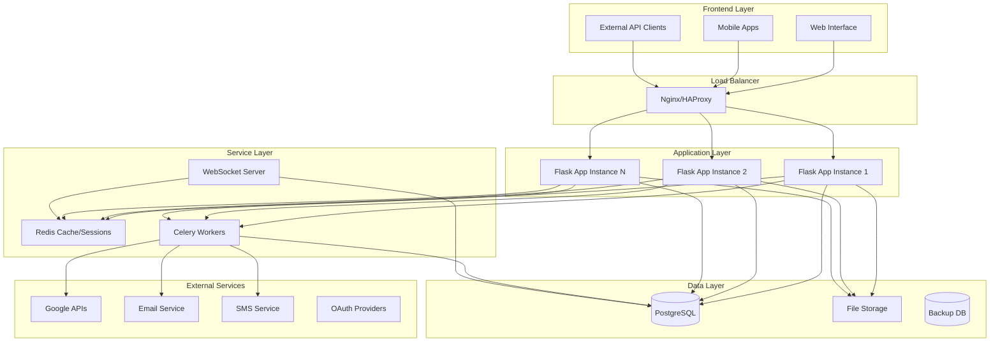
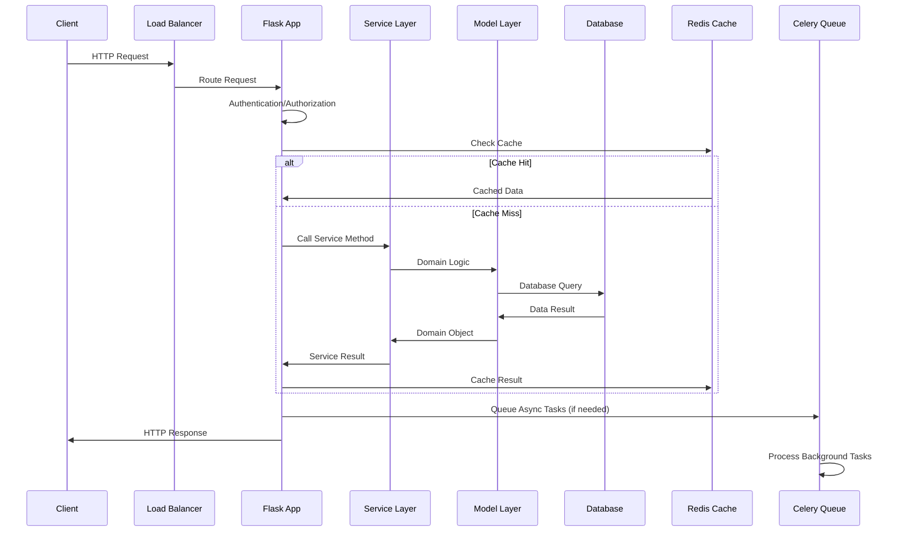
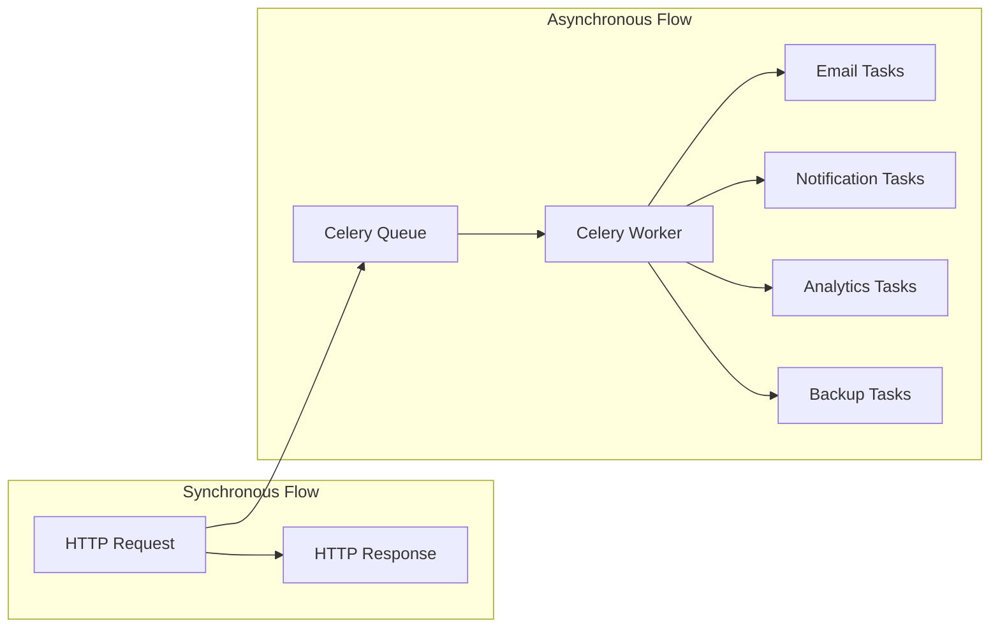
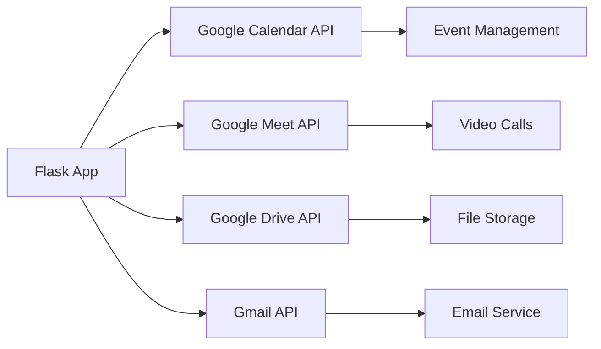

# Arquitectura del Sistema - Ecosistema de Emprendimiento

## 🎯 Visión General

El **Ecosistema de Emprendimiento** es una plataforma integral diseñada para conectar, gestionar y empoderar a emprendedores, mentores, aliados y stakeholders en un ambiente colaborativo. La arquitectura está basada en **Flask** con patrones de diseño modernos, siguiendo principios de **Clean Architecture** y **Domain-Driven Design**.

### Objetivos Arquitectónicos

- **Escalabilidad**: Arquitectura modular que permite crecimiento horizontal y vertical
- **Mantenibilidad**: Código organizado en capas bien definidas con separación de responsabilidades
- **Extensibilidad**: Facilidad para agregar nuevas funcionalidades y integraciones
- **Rendimiento**: Optimización de consultas, cache y procesamiento asíncrono
- **Seguridad**: Implementación robusta de autenticación, autorización y protección de datos

## 🏗️ Arquitectura General



## 🏛️ Arquitectura en Capas

### 1. Capa de Presentación (Presentation Layer)

**Responsabilidad**: Manejo de interfaces de usuario y APIs

```
├── api/                    # REST API endpoints
│   ├── v1/                # Versionado de API
│   └── middleware/        # Middleware específico de API
├── views/                 # Vistas web por rol de usuario
│   ├── admin/            # Interface administrativa
│   ├── entrepreneur/     # Portal emprendedor
│   ├── ally/            # Portal mentor/aliado
│   └── client/          # Portal cliente/stakeholder
├── templates/            # Templates HTML
├── static/              # Assets estáticos
└── sockets/             # WebSocket handlers
```

**Características**:
- API REST versionada (v1, v2...)
- Interfaces específicas por tipo de usuario
- WebSockets para comunicación en tiempo real
- Rate limiting y CORS configurado
- Documentación automática con Swagger/OpenAPI

### 2. Capa de Aplicación (Application Layer)

**Responsabilidad**: Lógica de aplicación y orquestación de servicios

```
├── services/              # Servicios de aplicación
│   ├── user_service.py           # Gestión usuarios
│   ├── entrepreneur_service.py   # Lógica emprendedores
│   ├── mentorship_service.py     # Sistema mentoría
│   ├── project_service.py        # Gestión proyectos
│   ├── notification_service.py   # Notificaciones
│   └── analytics_service.py      # Analytics y métricas
├── forms/                 # Formularios y validación
└── utils/                 # Utilidades transversales
```

**Patrones Implementados**:
- **Service Layer Pattern**: Encapsulación de lógica de negocio
- **Command Pattern**: Para operaciones complejas
- **Observer Pattern**: Para notificaciones y eventos
- **Strategy Pattern**: Para diferentes algoritmos de matching

### 3. Capa de Dominio (Domain Layer)

**Responsabilidad**: Modelos de negocio y reglas de dominio

```
├── models/                # Modelos de datos
│   ├── base.py           # Modelo base con funcionalidades comunes
│   ├── mixins.py         # Mixins reutilizables
│   ├── user.py           # Jerarquía de usuarios
│   ├── entrepreneur.py   # Dominio emprendedor
│   ├── ally.py          # Dominio mentor/aliado
│   ├── project.py       # Dominio proyecto
│   └── mentorship.py    # Dominio mentoría
└── core/                 # Lógica central del dominio
    ├── exceptions.py     # Excepciones de dominio
    ├── constants.py      # Constantes del negocio
    └── permissions.py    # Sistema de permisos
```

**Características**:
- **Rich Domain Models**: Modelos con comportamiento, no solo datos
- **Value Objects**: Para conceptos como Money, DateRange, etc.
- **Domain Events**: Para comunicación entre agregados
- **Repository Pattern**: Abstracción de acceso a datos

### 4. Capa de Infraestructura (Infrastructure Layer)

**Responsabilidad**: Acceso a datos y servicios externos

```
├── extensions.py          # Configuración de extensiones
├── config/               # Configuraciones por ambiente
├── tasks/                # Tareas asíncronas (Celery)
└── External Integrations:
    ├── Google Calendar/Meet
    ├── Email Services
    ├── SMS Services
    ├── OAuth Providers
    └── File Storage
```

## 🔄 Flujo de Datos y Procesamiento

### Flujo de Request Típico



### Procesamiento Asíncrono



## 🧩 Módulos Principales

### 1. Sistema de Usuarios y Autenticación

```python
# Jerarquía de usuarios con herencia
User (Base) -> Admin, Entrepreneur, Ally, Client

# Características:
- OAuth integration (Google, LinkedIn)
- Role-based access control (RBAC)
- Multi-factor authentication
- Session management con Redis
```

### 2. Sistema de Mentoría

```python
# Componentes principales:
- Matching algorithms (mentor-mentee)
- Session scheduling con Google Calendar
- Progress tracking y KPIs
- Video calls integration (Google Meet)
- Session notes y follow-ups
```

### 3. Gestión de Proyectos

```python
# Funcionalidades:
- Project lifecycle management
- Milestone tracking
- Resource allocation
- Impact measurement
- Reporting y analytics
```

### 4. Sistema de Comunicación

```python
# Canales de comunicación:
- WebSocket real-time messaging
- Email notifications
- SMS alerts
- Push notifications (future)
- Activity feeds
```

### 5. Analytics y Reportes

```python
# Métricas clave:
- User engagement metrics
- Project success rates
- Mentorship effectiveness
- ROI calculations
- Custom dashboards
```

## 🔌 Integraciones Externas

### Google Workspace Integration



### Servicios de Terceros

- **Email Service**: SendGrid/AWS SES para emails transaccionales
- **SMS Service**: Twilio para notificaciones SMS
- **File Storage**: AWS S3/Google Cloud Storage
- **Monitoring**: Sentry para error tracking
- **Analytics**: Google Analytics, Mixpanel

## 🛡️ Seguridad

### Capas de Seguridad

1. **Autenticación**
   - JWT tokens con refresh mechanism
   - OAuth 2.0 con Google, LinkedIn
   - MFA opcional para admins

2. **Autorización**
   - Role-based permissions
   - Resource-level access control
   - API rate limiting

3. **Protección de Datos**
   - Encryption at rest y in transit
   - GDPR compliance
   - Data anonymization para analytics

4. **Seguridad de API**
   - Input validation y sanitization
   - SQL injection prevention
   - CORS configuration
   - API versioning para backward compatibility

### Configuración de Seguridad

```python
# Ejemplo configuración
SECURITY_CONFIG = {
    'JWT_EXPIRATION': 3600,  # 1 hora
    'REFRESH_EXPIRATION': 2592000,  # 30 días
    'PASSWORD_COMPLEXITY': 'strong',
    'MFA_REQUIRED_ROLES': ['admin'],
    'SESSION_TIMEOUT': 1800,  # 30 minutos
    'RATE_LIMIT_PER_MINUTE': 60
}
```

## 📈 Escalabilidad y Rendimiento

### Estrategias de Escalabilidad

1. **Horizontal Scaling**
   - Load balancing con Nginx/HAProxy
   - Múltiples instancias de Flask app
   - Database read replicas

2. **Caching Strategy**
   ```mermaid
   graph TB
       APP[Flask App] --> L1[L1: Application Cache]
       APP --> L2[L2: Redis Cache]
       APP --> L3[L3: CDN Cache]
       L2 --> DB[(Database)]
   ```

3. **Database Optimization**
   - Índices optimizados
   - Query optimization
   - Connection pooling
   - Partitioning para large tables

4. **Asynchronous Processing**
   - Celery para tasks pesadas
   - WebSockets para real-time features
   - Background jobs para analytics

### Métricas de Rendimiento

```python
PERFORMANCE_TARGETS = {
    'response_time_p95': '< 200ms',
    'availability': '99.9%',
    'throughput': '1000 req/sec',
    'database_query_time': '< 50ms',
    'cache_hit_ratio': '> 85%'
}
```

## 🔧 Tecnologías Clave

### Backend Stack

```yaml
Core Framework: Flask 2.3+
Database: PostgreSQL 15+
Cache: Redis 7+
Task Queue: Celery 5+
Message Broker: Redis/RabbitMQ
WebSockets: Flask-SocketIO
Authentication: Flask-JWT-Extended
ORM: SQLAlchemy 2.0+
Migrations: Alembic
Testing: Pytest
```

### Frontend Stack

```yaml
Templates: Jinja2
CSS Framework: Tailwind CSS / Bootstrap 5
JavaScript: Modern ES6+ / Alpine.js
Build Tools: Webpack / Vite
Charts: Chart.js / D3.js
Real-time: Socket.IO client
```

### DevOps Stack

```yaml
Containerization: Docker / Docker Compose
Orchestration: Kubernetes (production)
CI/CD: GitHub Actions
Monitoring: Prometheus + Grafana
Logging: ELK Stack
Error Tracking: Sentry
```

## 📊 Patrones de Diseño Implementados

### 1. Repository Pattern
```python
class UserRepository:
    def find_by_id(self, user_id: int) -> Optional[User]:
        pass
    
    def find_entrepreneurs_by_criteria(self, criteria: dict) -> List[Entrepreneur]:
        pass
```

### 2. Service Layer Pattern
```python
class MentorshipService:
    def __init__(self, user_repo: UserRepository, notification_service: NotificationService):
        self.user_repo = user_repo
        self.notification_service = notification_service
    
    def create_mentorship_session(self, mentor_id: int, mentee_id: int) -> MentorshipSession:
        # Business logic here
        pass
```

### 3. Factory Pattern
```python
class UserFactory:
    @staticmethod
    def create_user(user_type: str, **kwargs) -> User:
        if user_type == 'entrepreneur':
            return Entrepreneur(**kwargs)
        elif user_type == 'ally':
            return Ally(**kwargs)
        # etc...
```

### 4. Observer Pattern
```python
class EventDispatcher:
    def __init__(self):
        self._observers = defaultdict(list)
    
    def subscribe(self, event_type: str, callback: Callable):
        self._observers[event_type].append(callback)
    
    def dispatch(self, event: DomainEvent):
        for callback in self._observers[event.type]:
            callback(event)
```

## 🚀 Deployment Architecture

### Desarrollo
```yaml
Environment: Docker Compose
Database: PostgreSQL container
Cache: Redis container
Queue: Celery with Redis broker
Monitoring: Local Grafana
```

### Producción
```yaml
Infrastructure: Kubernetes cluster
Database: Managed PostgreSQL (AWS RDS/Google Cloud SQL)
Cache: Managed Redis (ElastiCache/Google Memorystore)
Load Balancer: Cloud Load Balancer
CDN: CloudFront/CloudFlare
Monitoring: Prometheus + Grafana + AlertManager
```

## 📝 Consideraciones Futuras

### Roadmap Técnico

1. **Microservices Migration**
   - Separar módulos en microservices independientes
   - API Gateway para routing y authentication
   - Service mesh para comunicación inter-service

2. **AI/ML Integration**
   - Recommendation engine para mentor matching
   - Predictive analytics para project success
   - Natural language processing para chat features

3. **Mobile Applications**
   - React Native / Flutter apps
   - Push notifications
   - Offline capabilities

4. **Advanced Analytics**
   - Real-time analytics dashboard
   - Machine learning insights
   - Predictive modeling

### Métricas de Éxito

```yaml
Technical Metrics:
  - System Availability: 99.9%
  - Response Time P95: < 200ms
  - Error Rate: < 0.1%
  - Test Coverage: > 90%

Business Metrics:
  - User Engagement: Daily/Monthly Active Users
  - Success Rate: Project completion rate
  - Satisfaction: NPS score > 8.0
  - Growth: 20% monthly user growth
```

---

## 📚 Referencias y Documentación Adicional

- [Guía de Instalación](../INSTALLATION.md)
- [Documentación de API](../API.md)
- [Esquema de Base de Datos](./database.md)
- [Guía de Integraciones](./integrations.md)
- [Guía de Contribución](../CONTRIBUTING.md)

---

**Última actualización**: Junio 2025   
**Autor**: Equipo de Arquitectura